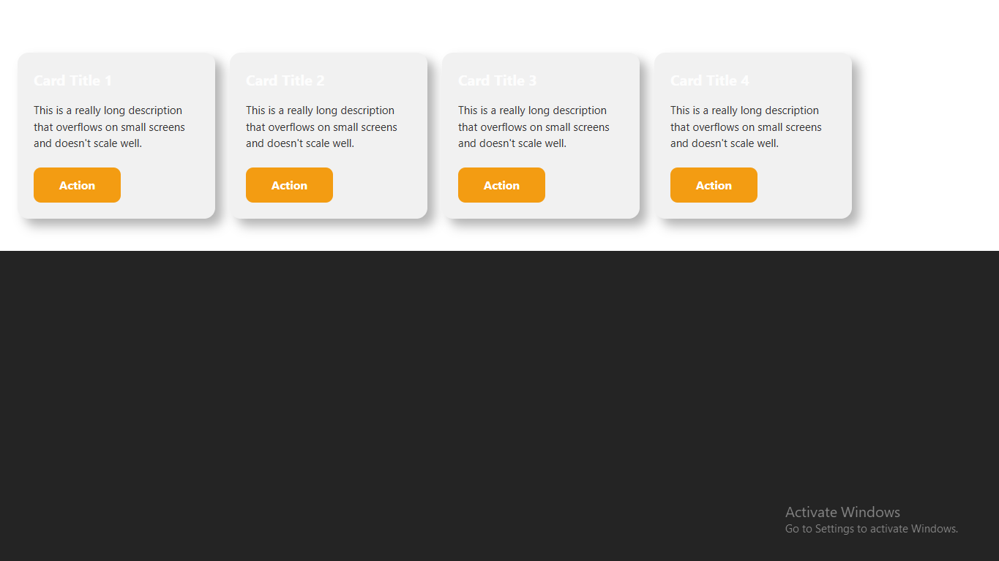
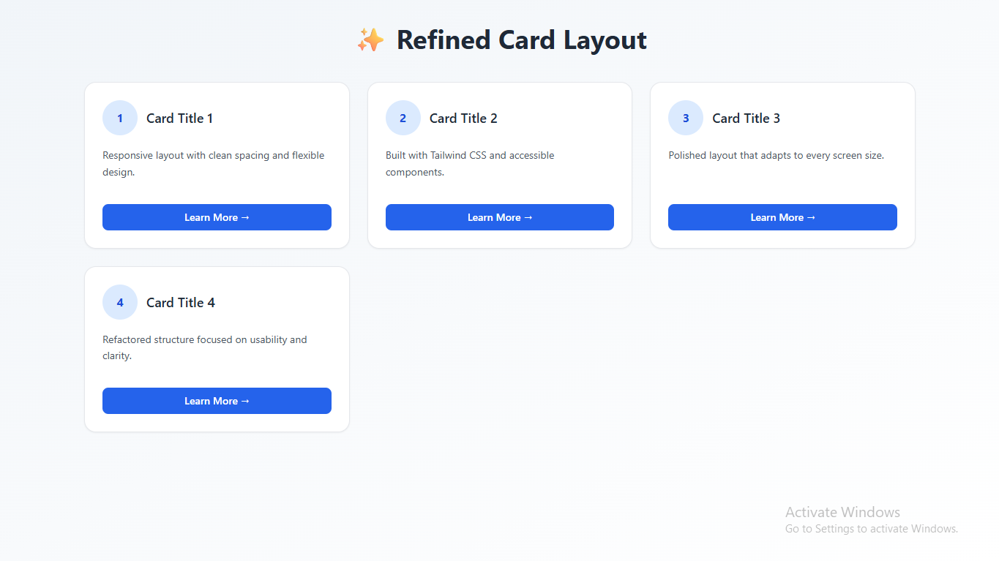
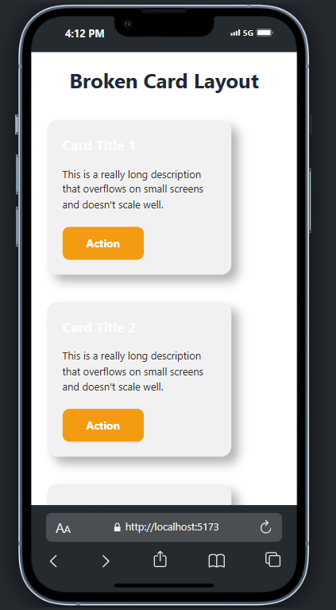
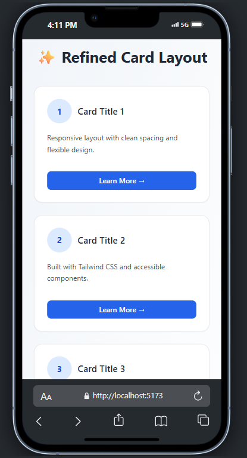

# 🛠️ UI Fix – Before & After (React + Tailwind CSS)

This project demonstrates a **real-world UI transformation** — converting a broken, hard-coded layout into a responsive, accessible, and modern user interface using React + Tailwind CSS.

---

## 📸 Visual Comparison

### 🖥 Desktop View

| ❌ Before                               | ✅ After                              |
| --------------------------------------- | ------------------------------------- |
|  |  |

### 📱 Mobile View

| ❌ Before                             | ✅ After                            |
| ------------------------------------- | ----------------------------------- |
|  |  |

---

## 🔍 Live UI Fix Demo

| ❌ Broken                                                                                    | ✅ Fixed                                                                                   |
| -------------------------------------------------------------------------------------------- | ------------------------------------------------------------------------------------------ |
| [View Broken Layout](https://ui-fix-before-after-reward-stephens-projects.vercel.app/before) | [View Fixed Layout](https://ui-fix-before-after-reward-stephens-projects.vercel.app/after) |

Or visit the [Landing Page](https://ui-fix-before-after-reward-stephens-projects.vercel.app) to toggle between both versions.

---

## 💥 The Problem (Before)

In the **Before** version:

- Fixed-width layout broke on small screens
- Hardcoded inline styles made components rigid and messy
- No spacing system, poor readability, and weak contrast
- Buttons lacked interaction and accessibility
- Overall design felt outdated and inconsistent

📄 [View full issue description](./before/description.md)

---

## ✅ The Fix (After)

In the **After** version:

- Used Tailwind utility classes for clean, scalable styles
- Implemented a responsive grid layout with mobile-first design
- Improved spacing, padding, and visual hierarchy
- Styled buttons for accessibility, interaction, and clarity
- Added hover states and transitions for better user feedback

🔧 [What Was Fixed (details)](./after/what-was-fixed.md)

---

## 🧱 Tech Stack

| Tool             | Purpose                       |
| ---------------- | ----------------------------- |
| **React**        | UI Framework                  |
| **Tailwind CSS** | Utility-first styling         |
| **TypeScript**   | Type safety + maintainability |
| **Vite**         | Lightning-fast dev server     |
| **Vercel**       | Deployment platform           |

---

## 📦 Run Locally

```bash
git clone https://github.com/Reward-steve/ui-fix-before-after.git
cd ui-fix-before-after
npm install
npm run dev
```

## 🎯 Why This Matters

Clients often come to you with broken layouts — this project proves you can:

- Identify and diagnose UI/UX flaws quickly
- Refactor hard-coded components into reusable, scalable systems
- Deliver responsive, mobile-optimized UIs
- Improve performance, usability, and developer experience

## 📬 Contact Me

- 📧 Email: rewardstephen30@gmail.com
- 🌐 Portfolio: [my-portfolio-website](https://my-portfolio-website-chi-kohl.vercel.app/)
- 💻 GitHub: [Reward-steve](https://github.com/Reward-steve)

**⭐ Found this helpful or inspiring?**
**Give the repo a ⭐ and share your thoughts!**
