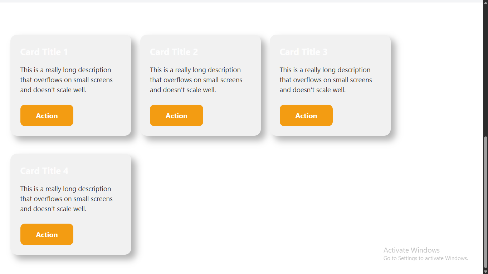
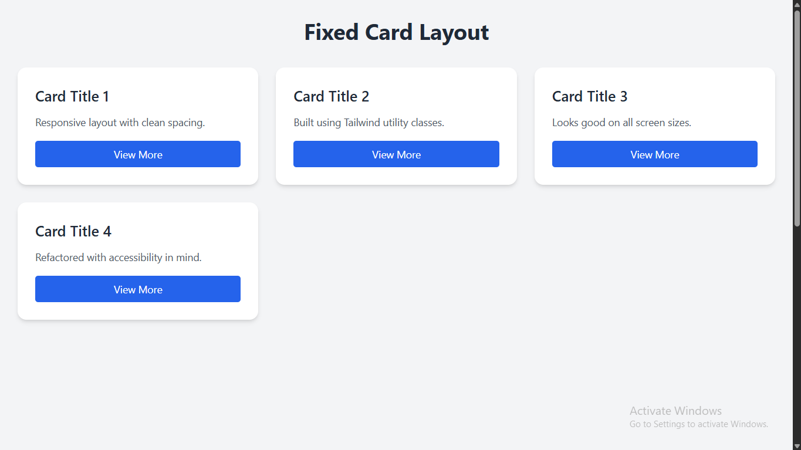

# 🛠️ UI Fix – Before & After (React + Tailwind CSS)

This project showcases a **real-world UI rescue scenario** — from broken, unresponsive layout to a clean, responsive, and professional UI.

---

## 📸 Visual Comparison

| ❌ Before                          | ✅ After                         |
| ---------------------------------- | -------------------------------- |
|  |  |

---

## 🔍 The Problem

In the **Before** version:

- Layout was hard-coded and broke on mobile
- Inline styles made scaling and readability difficult
- Spacing was inconsistent
- Buttons were visually weak and inaccessible
- Overall visual experience was poor

See full [issue description](./before/description.md)

---

## ✅ The Fix

In the **After** version:

- Tailwind CSS used for clean, consistent spacing
- Responsive grid system for flexible layouts
- Semantic button styles with accessible contrast
- Fully mobile-first and componentized
- Improved readability and code maintainability

Read all changes [here](./after/what-was-fixed.md)

---

## 🧱 Tech Stack

- **Framework**: React
- **Styling**: Tailwind CSS
- **Language**: TypeScript
- **Tooling**: Vite
- **Deployment**: Vercel

---

## 📦 Run Locally

```bash
git clone https://github.com/Reward-steve/ui-fix-before-after.git
cd ui-fix-before-after
npm install
npm run dev  # or npm start
```

## 🎯 Why This Matters

Clients often come with broken layouts — this repo proves I can:

- Spot UI/UX flaws quickly
- Fix layout bugs with clean, scalable code
- Deliver responsive, mobile-ready components fast
- Use this in proposals to show your UI repair skills in action.

## 📬 Contact Me

- Email: rewardstephen30@gmail.com
- GitHub: Reward-steve
- Portfolio: https://my-portfolio-website-chi-kohl.vercel.app

**⭐ If this helped or inspired you, feel free to star the repo.**
